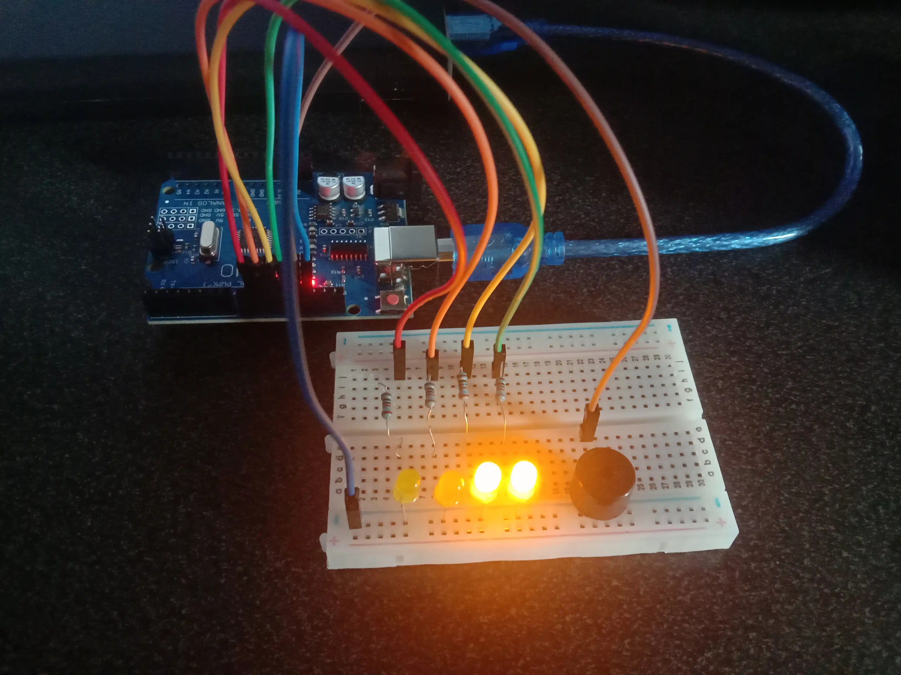
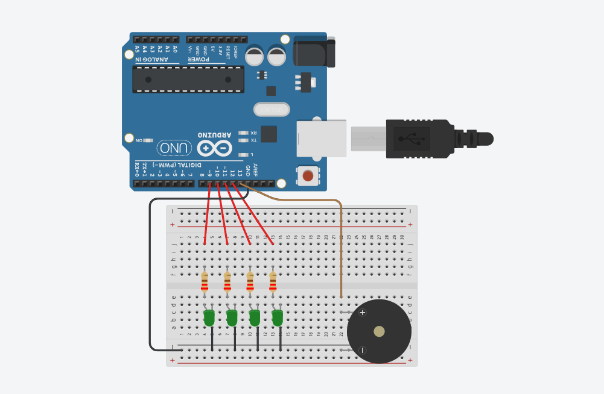

## [Tinkercad](https://www.tinkercad.com/things/k0BJLppvA1R-led-binary-counter-4bit/editel?returnTo=https%3A%2F%2Fwww.tinkercad.com%2Fdashboard&sharecode=j9uchLolSOxk4IyhNsWxlZMCAUrqUkRea24RYHwOLt8)

  
  

